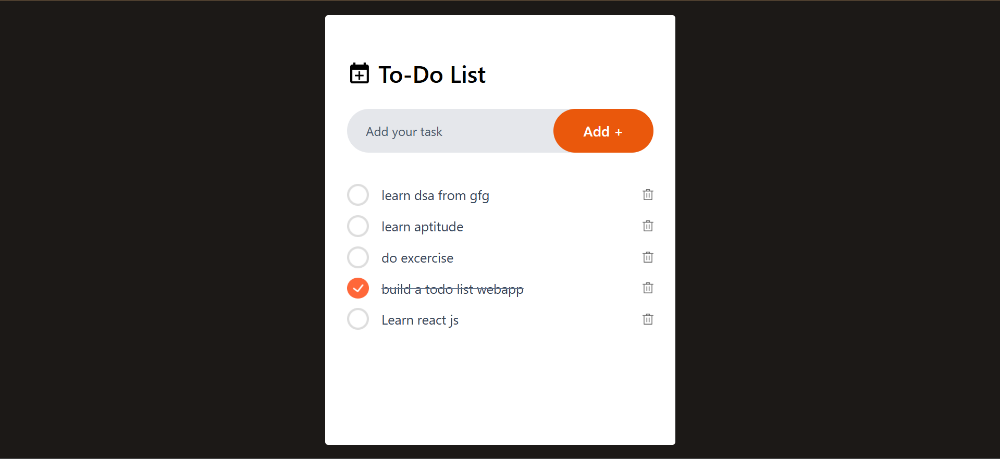

# 📝 To-Do List App

A simple and elegant **To-Do List application** built with **React.js** and **Tailwind CSS**.  
It allows users to add, delete, and mark tasks as completed — all data is stored in **Local Storage**, so tasks stay saved even after refreshing the page.

---

## 🚀 Features

- Add new tasks  
- Mark tasks as completed ✅  
- Delete tasks 🗑️  
- Persistent data using Local Storage  
- Responsive UI built with Tailwind CSS

---

## 🧰 Tech Stack

- **React.js**
- **Vite**
- **Tailwind CSS**
- **Local Storage API**

---

## 🖼️ Preview

  
---

